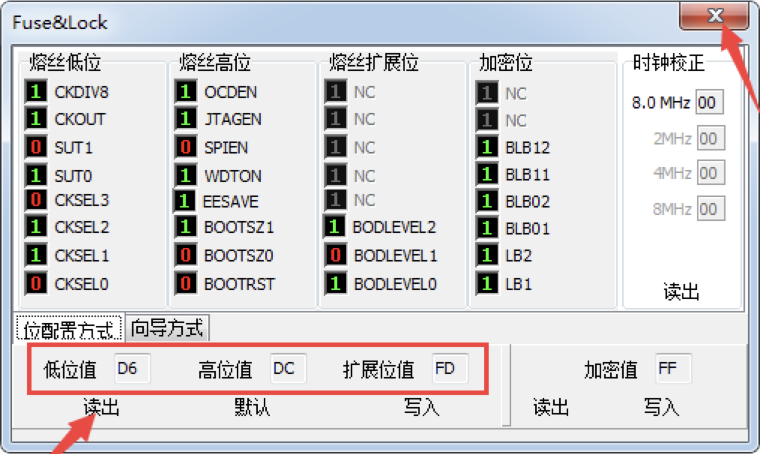

# Flashing a Creality Ender 3 firmware with the Bus Pirate

Gilbert François

- [Flashing a Creality Ender 3 firmware with the Bus Pirate](#flashing-a-creality-ender-3-firmware-with-the-bus-pirate)
  * [Abstract](#abstract)
  * [Install the BLTouch on the Ender 3](#install-the-bltouch-on-the-ender-3)
  * [Download the firmware](#download-the-firmware)
  * [Flash firmware with macOS or Linux](#flash-firmware-with-macos-or-linux)
    + [AVR programmer](#avr-programmer)
    + [Connecting the Bus Pirate to the printer's mainboard](#connecting-the-bus-pirate-to-the-printer-s-mainboard)
    + [Check connection and check/set fuses](#check-connection-and-check-set-fuses)
    + [Flash the firmware](#flash-the-firmware)
  * [Remove capacitor for Z-stop (optional)](#remove-capacitor-for-z-stop--optional-)
  * [Troubleshooting](#troubleshooting)
  * [Reference](#reference)

## Abstract

In this article, I write about my experience on how to install the [BLTouch auto bed leveling sensor for CR/Ender series](https://www.creality3dofficial.com/collections/bl-touch/products/creality-bl-touch) and how to flash the official precompiled firmware of the Ender 3 with macOS or Linux. Unfortunately Creality only describes how to flash the firmware with Windows and delivers software for Windows only. 

The article also shows one of the many capabilities of the Bus Pirate, which is a wonderful tool, that every hardware hacker should have, in my opinion. Here is what others say about it:

*"The Bus Pirate is an open source hacker multi-tool that talks to electronic stuff. It's got [a bunch of features](http://dangerousprototypes.com/docs/Features_overview) an intrepid hacker might need to prototype their next project."* - Dangerous Prototypes

*"The Bus Pirate v3.6a, created by [Ian Lesnet](http://dangerousprototypes.com/), is a troubleshooting tool that communicates between a computer and any embedded device over 1-wire, 2-wire, 3-wire, UART, I2C, SPI, and HD44780 LCD protocols - all at voltages from 0-5.5VDC. This product eliminates a ton of early prototyping effort when working with new or unknown chips."* - Sparkfun 

In this article, we will use it as an AVR programmer.


## Install the BLTouch on the Ender 3

Installing the hardware is quite straight forward, if you bought the [upgrade package](https://www.creality3dofficial.com/collections/bl-touch/products/creality-bl-touch). Follow the instructions on [this video.](https://www.youtube.com/watch?v=jqxlQkkt8cM) The fun part comes after installing the hardware.

[](https://www.youtube.com/watch?v=jqxlQkkt8cM)


## Download the firmware

Go to [https://www.creality.com/download](https://www.creality.com/download) and look for `Ender-3_8bit_1.1.6V_BL Touch Firmware_0814.rar`. Download this file and unpack with:

```bash
$ unrar -e Ender-3_8bit_1.1.6V_BL Touch Firmware_0814.rar
```

Note: You can install unrar with `brew` on macOS or `apt install` on Linux, in case you don't have it yet. After unpacking, the firmware file we need is called:

```
Ender-3Marlin1.1.6BLTouch.hex
```


## Flash firmware with macOS or Linux

### AVR programmer

You’ll need one of the following to actually perform the ISP (In System Programming) flashing:

- [SparkFun PocketAVR](https://www.sparkfun.com/products/9825) - (USB Tiny)
- [USBtinyISP AVR Programmer Kit](https://www.adafruit.com/product/46) - (USB Tiny)
- [Teensy 2.0](https://www.pjrc.com/store/teensy.html) - (avrisp)
- [Pro Micro](https://www.sparkfun.com/products/12640) - (avrisp)
- [Bus Pirate](https://www.adafruit.com/product/237) - (buspirate)

The ISP programmer (USB ISP v2) that was included in the package, did not work on my computer with avrdude. In [this video](https://www.youtube.com/watch?v=Hi7uPYJ_q-U), the author tells that it is because it is a clone programmer and incompatible with avrdude. 

I used a Bus Pirate V3.6 for AVR programming. Make sure you choose your ISP with the `avrdude -c` option if you use another programmer. All avrdude options can be found in [2].


### Connecting the Bus Pirate to the printer's mainboard

| BusPirate Signal | AVR Signal | ISP pin (6) |
| ---------------- | ---------- | ----------- |
| GND              | GND        | 6           |
| 5V               | Vcc        | 2           |
| CS               | RESET      | 5           |
| MOSI             | MOSI       | 4           |
| MISO             | MISO       | 1           |
| SCLK/CLK         | SCK        | 3           |

*Table 1: Bus Pirate AVR programming connections*

Connect the Bus Pirate to the printer's main board according to table 1. 


### Check connection and check/set fuses

Connect the Bus Pirate and find its port by typing:

````bash
$ ls /dev/tty*
/dev/tty
/dev/tty.Bluetooth-Incoming-Port
/dev/tty.usbserial-AB0JPMQQ
/dev/ttyp0
...
````

On my computer, it is `/dev/tty.usbserial-AB0JPMQQ`. First, test the connection with verbose `-v` option. If the connection works, the Bus Pirate is able to read out the properties and fuses of the micro controller:

```bash
$ avrdude -c buspirate -P /dev/tty.usbserial-AB0JPMQQ -p m1284p -v

avrdude: Version 6.3, compiled on Oct 11 2019 at 01:39:52
         Copyright (c) 2000-2005 Brian Dean, http://www.bdmicro.com/
         Copyright (c) 2007-2014 Joerg Wunsch

         System wide configuration file is "/usr/local/Cellar/avrdude/6.3_1/etc/avrdude.conf"
         User configuration file is "/Users/gilbert/.avrduderc"
         User configuration file does not exist or is not a regular file, skipping

         Using Port                    : /dev/tty.usbserial-AB0JPMQQ
         Using Programmer              : buspirate
         AVR Part                      : ATmega1284P
         Chip Erase delay              : 55000 us
         PAGEL                         : PD7
         BS2                           : PA0
         RESET disposition             : dedicated
         RETRY pulse                   : SCK
         serial program mode           : yes
         parallel program mode         : yes
         Timeout                       : 200
         StabDelay                     : 100
         CmdexeDelay                   : 25
         SyncLoops                     : 32
         ByteDelay                     : 0
         PollIndex                     : 3
         PollValue                     : 0x53
         Memory Detail                 :

                                  Block Poll               Page                       Polled
           Memory Type Mode Delay Size  Indx Paged  Size   Size #Pages MinW  MaxW   ReadBack
           ----------- ---- ----- ----- ---- ------ ------ ---- ------ ----- ----- ---------
           eeprom        65    10   128    0 no       4096    8      0  9000  9000 0xff 0xff
           flash         65    10   256    0 yes    131072  256    512  4500  4500 0xff 0xff
           lock           0     0     0    0 no          1    0      0  9000  9000 0x00 0x00
           lfuse          0     0     0    0 no          1    0      0  9000  9000 0x00 0x00
           hfuse          0     0     0    0 no          1    0      0  9000  9000 0x00 0x00
           efuse          0     0     0    0 no          1    0      0  9000  9000 0x00 0x00
           signature      0     0     0    0 no          3    0      0     0     0 0x00 0x00
           calibration    0     0     0    0 no          1    0      0     0     0 0x00 0x00

         Programmer Type : BusPirate
         Description     : The Bus Pirate

Attempting to initiate BusPirate binary mode...
BusPirate binmode version: 1
BusPirate SPI version: 1
avrdude: Paged flash write enabled.
AVR Extended Commands not found.
avrdude: AVR device initialized and ready to accept instructions

Reading | ################################################## | 100% 0.09s

avrdude: Device signature = 0x1e9705 (probably m1284p)
avrdude: safemode: hfuse reads as DC
avrdude: safemode: efuse reads as FD

avrdude: safemode: hfuse reads as DC
avrdude: safemode: efuse reads as FD
avrdude: safemode: Fuses OK (E:FD, H:DC, L:D6)
BusPirate is back in the text mode

avrdude done.  Thank you.
```

If the fuses read: `L: D6, H: DC: E: FD`, then all is fine. If not, set the fuses with avrdude:

```bash
$ avrdude -c buspirate -P /dev/tty.usbserial-AB0JPMQQ -p m1284p -U lfuse:w:0xd6:m -U hfuse:w:0xdc:m -U efuse:w:0xfd:m
```



*Figure 1: Values for the fuses: LOW: **D6**, HIGH: **DC**: EXTENDED: **FD**. Screenshot from the Creality Ender 3 manual.*


### Flash the firmware

Now, let's flash the firmware using the command below:

```bash
$ avrdude -c buspirate -P /dev/tty.usbserial-AB0JPMQQ -p m1284p -v -U flash:w:Ender-3Marlin1.1.6BLTouch.hex

avrdude: Version 6.3, compiled on Oct 11 2019 at 01:39:52
         Copyright (c) 2000-2005 Brian Dean, http://www.bdmicro.com/
         Copyright (c) 2007-2014 Joerg Wunsch

         System wide configuration file is "/usr/local/Cellar/avrdude/6.3_1/etc/avrdude.conf"
         User configuration file is "/Users/gilbert/.avrduderc"
         User configuration file does not exist or is not a regular file, skipping

         Using Port                    : /dev/tty.usbserial-AB0JPMQQ
         Using Programmer              : buspirate
         AVR Part                      : ATmega1284P
         Chip Erase delay              : 55000 us
         PAGEL                         : PD7
         BS2                           : PA0
         RESET disposition             : dedicated
         RETRY pulse                   : SCK
         serial program mode           : yes
         parallel program mode         : yes
         Timeout                       : 200
         StabDelay                     : 100
         CmdexeDelay                   : 25
         SyncLoops                     : 32
         ByteDelay                     : 0
         PollIndex                     : 3
         PollValue                     : 0x53
         Memory Detail                 :

                                  Block Poll               Page                       Polled
           Memory Type Mode Delay Size  Indx Paged  Size   Size #Pages MinW  MaxW   ReadBack
           ----------- ---- ----- ----- ---- ------ ------ ---- ------ ----- ----- ---------
           eeprom        65    10   128    0 no       4096    8      0  9000  9000 0xff 0xff
           flash         65    10   256    0 yes    131072  256    512  4500  4500 0xff 0xff
           lock           0     0     0    0 no          1    0      0  9000  9000 0x00 0x00
           lfuse          0     0     0    0 no          1    0      0  9000  9000 0x00 0x00
           hfuse          0     0     0    0 no          1    0      0  9000  9000 0x00 0x00
           efuse          0     0     0    0 no          1    0      0  9000  9000 0x00 0x00
           signature      0     0     0    0 no          3    0      0     0     0 0x00 0x00
           calibration    0     0     0    0 no          1    0      0     0     0 0x00 0x00

         Programmer Type : BusPirate
         Description     : The Bus Pirate

Attempting to initiate BusPirate binary mode...
BusPirate binmode version: 1
BusPirate SPI version: 1
avrdude: Paged flash write enabled.
AVR Extended Commands not found.
avrdude: AVR device initialized and ready to accept instructions

Reading | ################################################## | 100% 0.08s

avrdude: Device signature = 0x1e9705 (probably m1284p)
avrdude: safemode: hfuse reads as DC
avrdude: safemode: efuse reads as FD
avrdude: NOTE: "flash" memory has been specified, an erase cycle will be performed
         To disable this feature, specify the -D option.
avrdude: erasing chip
avrdude: reading input file "Ender-3Marlin1.1.6BLTouch.hex"
avrdude: input file Ender-3Marlin1.1.6BLTouch.hex auto detected as Intel Hex
avrdude: writing flash (127988 bytes):

Writing | ################################################## | 100% 215.85s

avrdude: 127988 bytes of flash written
avrdude: verifying flash memory against Ender-3Marlin1.1.6BLTouch.hex:
avrdude: load data flash data from input file Ender-3Marlin1.1.6BLTouch.hex:
avrdude: input file Ender-3Marlin1.1.6BLTouch.hex auto detected as Intel Hex
avrdude: input file Ender-3Marlin1.1.6BLTouch.hex contains 127988 bytes
avrdude: reading on-chip flash data:

Reading | ################################################## | 100% 4093.06s

avrdude: verifying ...
avrdude: 127988 bytes of flash verified

avrdude: safemode: hfuse reads as DC
avrdude: safemode: efuse reads as FD
avrdude: safemode: Fuses OK (E:FD, H:DC, L:D6)
BusPirate is back in the text mode

avrdude done.  Thank you.

```


## Remove capacitor for Z-stop (optional)

Todo....


## Troubleshooting

​	*The connection cannot be established.*

Try switching on power of the printer. It might be that the computer via the Bus Pirate is not delivering enough power to the mainboard of the printer.

​	*If the print head does not respond when probe pin is pushed in.*

Remove the capacitor near the Z-Stop plug on the mainboard, as described in section [Remove capacitor for Z-stop (optional)](#remove-capacitor-for-z-stop--optional-)


## Reference

[1] [Engbedded Atmel AVR Fuse Calculator](https://www.engbedded.com/fusecalc/)

[2] [AVRdude option reference](https://www.nongnu.org/avrdude/user-manual/avrdude_4.html#Option-Descriptions)

[3] [YouTube: Creality BL Touch Auto Bed Leveling Sensor Installation Tutorial](https://www.youtube.com/watch?v=jqxlQkkt8cM)

[4] [YouTube: Creality BLtouch Ender 3 upgrade kit - Step by step guide with fixes](https://www.youtube.com/watch?v=Hi7uPYJ_q-U)

[5] [Bus Pirate](http://dangerousprototypes.com/docs/Bus_Pirate)

[6] [Bus Pirate AVR Programming](http://dangerousprototypes.com/docs/Bus_Pirate_AVR_Programming)

[7] [Wikipedia: In System Programming (ISP)](https://en.wikipedia.org/wiki/In-system_programming)

[8] [AVR Tutorial](https://www.ladyada.net/learn/avr/avrdude.html)

[comment]: # "https://ecotrust-canada.github.io/markdown-toc/"